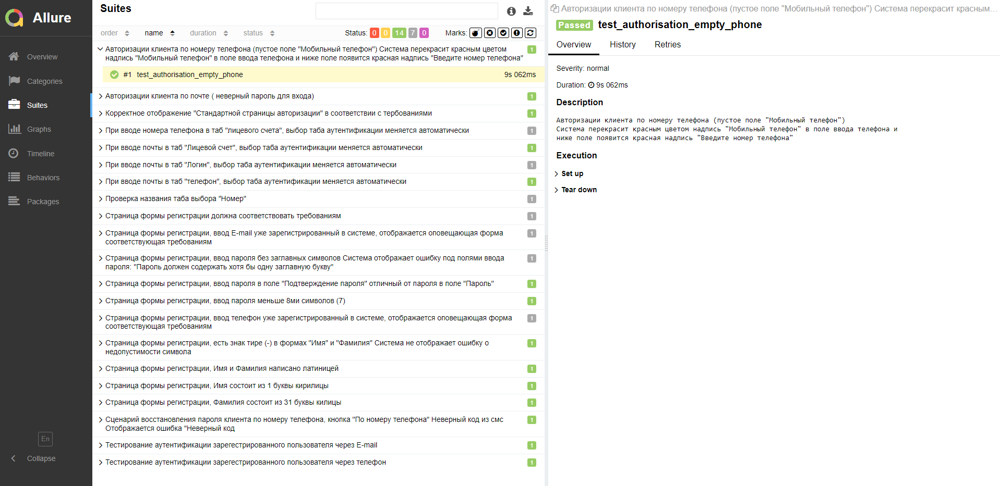

Проект содержит UI тесты ЛК "Ростелеком": https://b2c.passport.rt.ru

В корне лежит файл param.py с тестовыми данными

Папка Tests содержит файл автотестов

test_rostelecom.py 

Папка Pages содержит следующие файлы:

base.py - содержит библиотеку Smart Page Object

auth_page.py - содержит класс для страницы "Авторизация"

elements.py - содержит класс для определения элементов на веб-страницах

register_page.py - содержит класс для страницы "Регистрация"


How To Run Tests


1) Install all requirements:
   ```bash
    pip install -r requirements.txt
   ```
2) Run tests:

    ```bash
    python3 -m pytest -s -v test_rostelecom.py

    ```
   или
    ```bash
    python -m pytest -s -v test_rostelecom.py

    ```
   Команда для запуска теста с инструментом построения отчётов  - Allure

    ```bash
    python3 -m pytest -s -v test_rostelecom.py --alluredir=alluress

    ```
   Можно запускать тесты сразу все или по отдельности через PyCharm нажитием на иконку стрелки запуска.

3) Команда для запуска отчета  с помощью Allure
   ```bash
    allure serve alluress     
    ```
   
Отчет Allure с описаниями всех автотестов:

